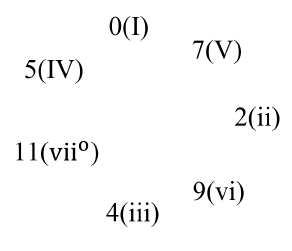
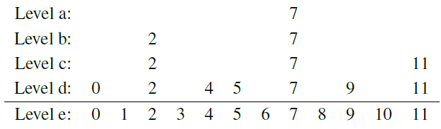
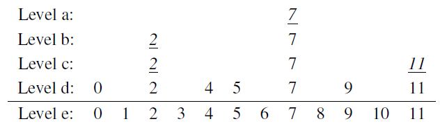
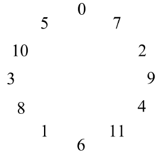
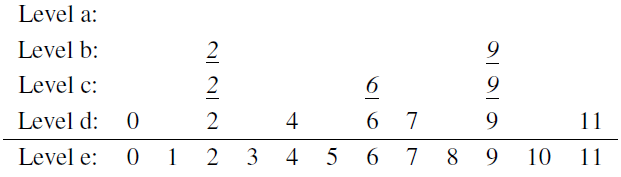
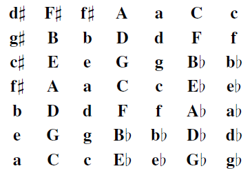
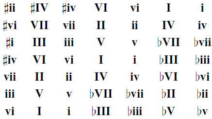
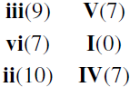
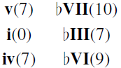
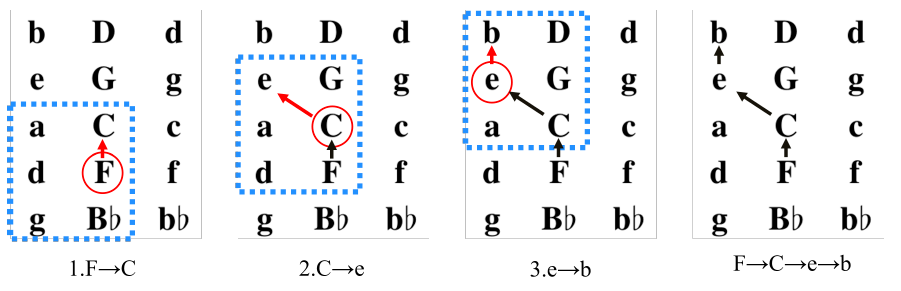

# Tonal Pitch Spaces
We introduce chord proximity, regional proximity, and chord/regional proximity based on the Tonal Pitch Space (TPS)[^1]. TPS is a complementary theory to A Generative Theory of Tonal Music (GTTM)[^2], which is a cognitive tonal music theory that focuses on structure. TPS considers the mathematical structure of music, such as the circle of fifths and chord compositions.

> Note: To avoid duplicating mathematical notations and symbols in our paper, some notations in this page might be defferent from the original TPS. 

## Chord Proximity

### Pitch Class

A pitch class is a pitch-value pair assigned from 0 to 11 according to the pitch name (<a href="#pc">Tab. 1</a>, hereafter pc as its abbreviation). It is because TPS calculation does not depend on the octave of the pitch. In a pc, for example, $\rm{}C3$ and $\rm{}C4$ belong to the same class $\rm{}C$ and have 0 as a value. And, the same pc applies to homophonic names, so $\rm{}C\sharp3$ and $\rm{}D\flat4$ belong to the same class, $\rm{}C\sharp/D\flat$, and have 1 as a value.

Table. 1
A pitch class.

<table id="pc">
</table>

pc | $\rm{C}$ | $\rm{}C\sharp/D\flat$ | $\rm{}D$ | $\rm{}D\sharp/E\flat$ | $\rm{}E$ | $\rm{}F$ | $\rm{}F\sharp/G\flat$ | $\rm{}G$ | $\rm{}G\sharp/A\flat$ | $\rm{}A$ | $\rm{}A\sharp/B\flat$ | $\rm{}B$
:---: | :---: | :---: | :---: | :---: | :---: | :---: | :---: | :---: | :---: | :---: | :---: | :---:
value | 0 | 1 | 2 | 3 | 4 | 5 | 6 | 7 | 8 | 9 | 10 | 11

### Basic Space

The basic space is a two-dimensional space with the pc and the influence as four levels and indicates how influential a note is in a chord. <a href="#bs_desc">Tab. 2</a> shows the meaning of influence levels and <a href="#bs_c">Fig. 1</a> shows the basic space of $\rm{I}/\mathbf{C}$. The closer a note is to Level a, the more influential it is in the chord (e.g., $\rm{}C(0)$ is the most influential note in $\rm{I}/\mathbf{C}$).

Table. 2
Level and its description in the basic space.

<table id="bs_desc">
</table>

Level|Description
:---: | :---:
Level a | The root of a chord.
Level b | The root of fifth of a chord.
Level c | The components of a chord.
Level d | The diatonic scale of chord's key.
Level e | All pitch classes.

<figure id="bs_c">

<figcaption>Figure. 1 The basic space of I/C.</figcaption>

</figure>

### Chord Proximity within A Region

Chord proximity is calculated based on two factors: the diatonic circle of fifths(<a href="#cof">Fig. 2</a>) and the common notes. The diatonic circle of fifths is the diatonic scale arranged in a circle by the *chord-circle rule* on the basic space, with Roman numerals representing degrees and arithmetic numbers representing the pc values of the root note of the chord. The *chord-circle rule* can be stated as:

>move the pcs at level a-c four diatonic steps to the right or left

A diatonic step means the movement of a pc on level d. As <a href="#cof">Fig. 2</a>, applying the chord-circle rule once to the right on $\rm{I}/\mathbf{C}$ (<a href="#bs_c">Fig. 1</a>) produces $\rm{V}/\mathbf{C}$(<a href="#bs_g">Fig. 3</a>) and to the left produces $\rm{IV}/\mathbf{C}$. Also note that the pc values overlap, so the right of 11 is 0, and the left of 0 is 11.

And the common note, another factor of the chord proximity, is the number of *distinctive* pcs in basic spaces between two chords. For instance, in <a href="#bs_c_g_comparison">Fig. 4</a>, underscored numbers mean distinctive pcs between $\rm{I}/\mathbf{C}$ and $\rm{V}/\mathbf{C}$. This figure is like $\rm{V}/\mathbf{C}$ overlain on $\rm{I}/\mathbf{C}$, so the level of pc2 in $\rm{I}/\mathbf{C}$ is 1 and one in $\rm{V}/\mathbf{C}$ is 3, thus the distinctive pc2 is $3-1=2$. From now, we formulate the chord proximity $c$ between a chord $x$ and a chord $y$ as

$$c(x\rightarrow y) = j+k$$ 

where $j$ is the shortest number of steps in the circle of fifths and $k$ is the number of distinctive pcs (e.g., <a href="#bs_c_g_comparison">Fig. 4</a>).

<figure id="cof">

<figcaption>Figure. 2 The diatonic circle of fifths.</figcaption>

</figure>

<figure id="bs_g">

<figcaption>Figure. 3 The basic space of V/C.</figcaption>

</figure>

<figure id="bs_c_g_comparison">

<figcaption>Figure. 4 Derivation of chord proximity: I/C → V/C.</figcaption>

</figure>

$$c(\rm{I}/\mathbf{C}\rightarrow\rm{V}/\mathbf{C})=1+4=5$$

### Chord Proximity across Regions

To get chord proximity for chords in different regions, we need an additional measurement, a regional shift. With the same chord proximity and the diatonic circle of fifths, a regional shift is calculated on the chromatic circle of fifths by the *regional-circle rule* on the basic space (<a href="#chromatic_cof">Fig. 5</a>) and the *regional-circle rule* can be stated as: 

>move the pcs at level d seven chromatic steps to the right or left

A chromatic step means the movement of a pc on level e. And of course, a regional shift between the same region will be 0. Now we can enlarge the formula $c$ with a regional shift as 

$$c(x\rightarrow y) = i+j+k$$ 

where $i$ is the steps on the region circle, $j$ and $k$ are the same as before. <a href="#bs_comparison_diff">Fig. 6</a> shows the derivation of chord proximity across regions, $\mathbf{C}$ to $\mathbf{G}$. Here, although $\rm{V}/\mathbf{C}$ and $\rm{I}/\mathbf{G}$ both refer to G-major, $c(\rm{I}/\mathbf{C}\rightarrow\rm{V}/\mathbf{C})=5$ and $c(\rm{I}/\mathbf{C}\rightarrow\rm{I}/\mathbf{G})=7$ mean that the chord proximity will be different depending on their regions. In general, the chord proximity is smaller when interpreted without musical modulation [^3].

<figure id="chromatic_cof">

<figcaption>Figure. 5 The chromatic circle of fifths.</figcaption>

</figure>

<figure id="bs_comparison_diff">

<figcaption>Figure. 6 Derivation of chord proximity: I/C → I/G.</figcaption>

</figure>

$$c(\rm{I}/\mathbf{C}\rightarrow\rm{I}/\mathbf{G})=1+1+5=7$$

### Regional Space

Regional proximity is the proximity of a region in terms of the *distance of its local tonic*. This step is justified because one strongly hears chords in relation to their local tonic as well as to one overall governing tonic [^1]. In the calculation of regional proximity, we use the regional space, a torus of regions. First we place the tonic $\rm{I}/\mathbf{I}$ and the local tonics $\rm{I}/\mathbf{V}, \rm{I}/\mathbf{IV}, \rm{i}/\mathbf{vi}, \rm{i}/\mathbf{i}$ that have the smallest chord proximity $c=7$ from the tonic on a torus. The region in the circle of fifths ($\rm{I}/\mathbf{V}, \rm{I}/\mathbf{IV}$) placed on the vertical axis, and relative and parallel minor ($\rm{i}/\mathbf{vi}, \rm{i}/\mathbf{i}$) placed on the horizontal axis. Then do this procedure recursively to form a torus, showed in <a href="#regional_space">Fig. 7</a> and <a href="#regional_space_rel">Fig. 8</a>.

<figure id="regional_space">

<figcaption>Figure. 7 The regional space.</figcaption>

</figure>

<figure id="regional_space_rel">

<figcaption>Figure. 8 The regional space (subregions oriented to C-major).</figcaption>

</figure>

### Pivots and Regional Proximity

The regional space suggests a further reason why the above formula for $c$ works for nearby but not distant regions. Nearby regions share chords that can function as *pivot chords* from one region to another. But as chromatic changes infiltrate more distant regions, direct pivot chords disappear, requiring intermediate pivots that have not yet been taken into account [^1]. From these point of view, the regional proximity from the starting region $\mathbf{S}$ to the destination region $\mathbf{D}$, $\delta\left(\mathbf{S}\rightarrow \mathbf{D}\right)$ can be stated as

$$\delta\left(\mathbf{S}\rightarrow \mathbf{D}\right):= c_1+c_2+\ldots+c_n$$ 
    
where $c_1$ is the intermediate chord proximity from the starting region to the tonic of the first pivot region (the first tonic pivots), $c_2$ is the intermediate chord proximity from the tonic of the first pivot region to the second one, and so on. In this calculation, the regional proximity needs the six-regional units called *pivot regions* (<a href="#pivot">Fig. 9</a>) and tonic of pivot regions called *tonic pivots*. For example, $\delta\left(\mathbf{F}\rightarrow \mathbf{b}\right)$ can be calculated with pivots $\mathbf{F}\rightarrow \mathbf{C}\rightarrow \mathbf{e}\rightarrow \mathbf{b}$ as in <a href="#pivoting">Fig. 10</a>. And as you can see in this example, there are multiple routing for $\mathbf{S}\rightarrow \mathbf{D}$ since pivot regions have at least five candidates (e.g., a routing for $\mathbf{F}\rightarrow \mathbf{b}$ can be interpreted as $\mathbf{F}\rightarrow \mathbf{C}\rightarrow \mathbf{e}\rightarrow \mathbf{b}$, $\mathbf{F}\rightarrow \mathbf{C}\rightarrow \mathbf{G}\rightarrow \mathbf{b}$, etc.). So we'll use the minimum regional proximity of all regions in this paper. These values can be computed with some algorithms such as Dijkstra's algorithm and Bellman-Ford algorithm since this routing can be taken as the shortest path from a single source vertex to all of the other vertices in a weighted graph.

<figure id="pivot">

<figcaption>Figure. 9 Pivot regions with their proximity value from I and i, respectively.</figcaption>

</figure>

<figure id="pivoting">

<figcaption>Figure. 10 An example of routing F→b. 

Blue rectangles: pivot regions, red circles: the starting point or
pivots. 
</figcaption>

</figure>

### Chord/Regional Proximity

From these definitions, the chord/regional proximity, the chord proximity enlarged with the regional proximity, $\delta$ can be determined as:

$$\delta\left(\rm{D_1}/\mathbf{R_1}\rightarrow \rm{D_2}/\mathbf{R_2}\right) :=
    d\left(\rm{D_1}/\mathbf{R_1}\rightarrow \mathbf{P_1}\right)
    +\delta\left(\mathbf{P_1}\rightarrow \mathbf{P_n}\right)
    +d\left(\mathbf{P_n}\rightarrow \rm{D_2}/\mathbf{R_2}\right)
$$ 
    
where $\rm{D_{\mathit{i}}}/\mathbf{R_{\mathit{i}}}$ is the chord of the degree $\rm{D_{\mathit{i}}}$ on region $\rm{\mathbf{R_{\mathit{i}}}}$ and $\mathbf{P_{\mathit{k}}}$ is a tonic pivot.

[^1]: F. Lerdahl, *Tonal Pitch Space*. Oxford University Press, 2001.

[^2]: F. Lerdahl, R. Jackendoff. *A Generative Theory of Tonal Music*, Cambridge, Mass: MIT Press, 1983.

[^3]: S. Sakamoto and S. Tojo. *Harmony Analysis of Music in Tonal Pitch Space*, in IPSJ SIG Technical Report, Vol.2009-MUS-80, No.9, pp.1-6, 2009, (in Japanese).